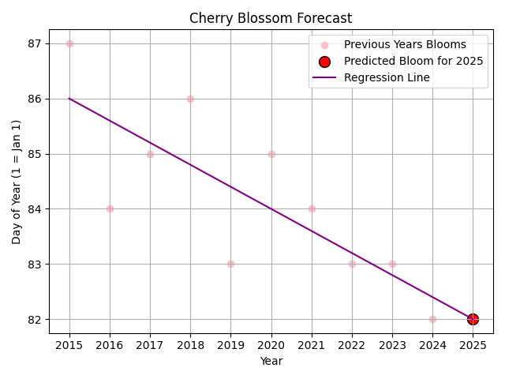

# 🌸 Cherry Blossom Forecast (Busan)

A simple Python project that predicts cherry blossom bloom dates in Busan using linear regression and historical data.

## Features

- Reads data from CSV
- Calculates bloom date trends manually (no numpy or pandas)
- Predicts bloom date for a future year
- Visualizes trend using matplotlib

## Example Output

🌸 Predicted Cherry Blossom Day for 2025: March 22

## 📊 Example Plot




## 🌸 Personal Observation


Tree was captured at 2025.03.23 next to S06 building at Suenghak Campus of Dong-A University

## 📁 Files

- `main.py` — Main code
- `busan_bloom_dates.csv` — Historical bloom data
- `myplot.png` — Visual of prediction

## 📦 Installation

Create a virtual environment (optional but recommended):

```bash
python -m venv venv
source venv/bin/activate  # On Windows use: .\venv\Scripts\activate
```

Install dependencies:

```bash
pip install -r requirements.txt
```

## How to Run

```bash
python main.py
```

